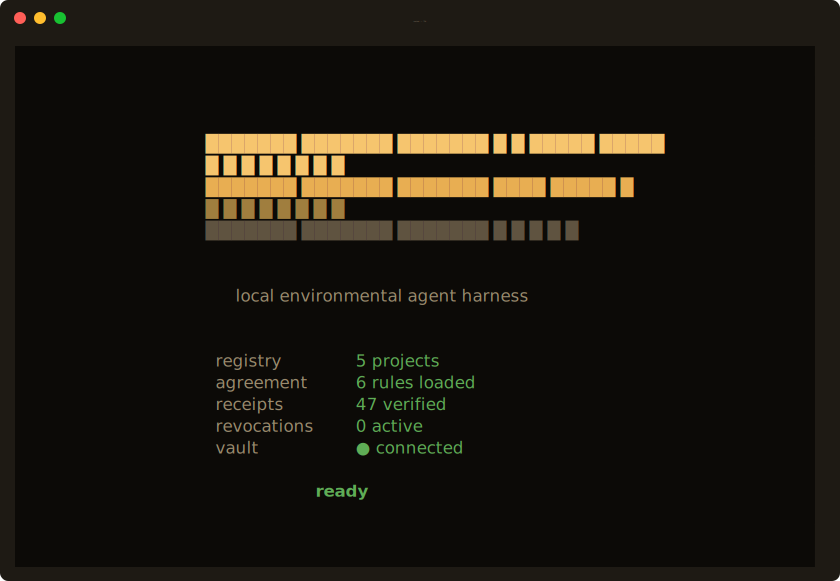

# Seshat

Govern what AI agents do on your machine.

*Part of the Liminate family — trust infrastructure for autonomous AI, built on a [62-word prose-as-syntax language](https://github.com/rmichaelthomas/liminate).*

Seshat is a local governance layer for AI coding agents. It sits between your agent (Claude Code, Cursor, Windsurf) and your machine, enforcing permissions you write in plain English. Every action — permitted or denied — gets a tamper-proof, hash-chained receipt. Not a sandbox. Not a prompt wrapper. A governance layer with a receipt chain.

## See it in action

**Full CLI + live agent governance loop** — Agreement enforcement, receipts, agent attribution, chain verification:


**Interactive TUI** — Projects, Ports, and Receipts tabs:



## What it does

You write an Agreement — a few lines of plain English declaring what an agent may and may not do — and Seshat enforces it at the MCP tier. No matching permit? Denied. A `forbid` always wins. Every action produces a hash-chained receipt you can verify, sync, and audit. Optionally, a verification contract checks environment correctness after every permitted action via the [Invariant](https://github.com/rmichaelthomas/liminate-invariant) harness.

## Example

```
permit actor is "claude-code" and action is "start_project"
permit actor is "claude-code" and action is "stop_project"
forbid action is "set_secret" because "secrets stay manual"
```

```bash
seshat agreement init
seshat agreement check start_project --actor claude-code
# → ALLOW  mode=permitted
```

→ Full Agreement walkthrough and examples at [liminate.dev/agreements](https://liminate.dev/agreements)

## Built by Liminate

Seshat is built on [Liminate](https://github.com/rmichaelthomas/liminate), a prose-as-syntax language where plain English sentences execute directly.

| | Repo | What it does |
|---|---|---|
| **← this repo** | [**seshat-app**](https://github.com/rmichaelthomas/seshat-app) | **Local agent harness. Agreement enforcement, receipts, CLI/TUI/dashboard/MCP server.** |
| | [liminate](https://github.com/rmichaelthomas/liminate) | The language and interpreter. 62 words, deterministic execution, domain packs. |
| | [liminate-invariant](https://github.com/rmichaelthomas/liminate-invariant) | Semantic verification harness. Deterministic claim-verification correction loop. |
| | [liminate-mcp](https://github.com/rmichaelthomas/liminate-mcp) | Authoring MCP server. Helps an agent draft, validate, explain, and test Agreements. |

→ [liminate.dev](https://liminate.dev)

## Install

Requires Python 3.11+.

```bash
brew tap rmichaelthomas/seshat
brew install seshat

seshat --help
seshat agreement init
```

If `brew install seshat` fails right after tapping with an "untrusted tap"
error, Homebrew requires new third-party taps to be trusted once before
their formulae can be installed:

```bash
brew trust rmichaelthomas/seshat
brew install seshat
```

Or from source:

```bash
git clone https://github.com/rmichaelthomas/seshat-app.git
cd seshat-app
pip install .
```

The harness runs entirely on your machine. No network calls, no telemetry, no account required.

## Quick start

### 1. Write an Agreement

```bash
seshat agreement init
```

This writes a starter Agreement to `~/.seshat/agreement.limn`. Edit it — `permit` what your agent should do, `forbid` what it shouldn't.

### 2. Connect your agent

**Claude Desktop** — edit `~/Library/Application Support/Claude/claude_desktop_config.json`:

```json
{
  "mcpServers": {
    "seshat": {
      "command": "seshat",
      "args": ["mcp"]
    }
  }
}
```

**Claude Code:**

```bash
claude mcp add seshat -- seshat mcp
```

### 3. See what happens

```bash
seshat receipts                    # recent agent actions
seshat receipts verify             # verify the hash chain
seshat receipts --tail             # live-follow
```

## The Agreement

The Agreement is written in [Liminate](https://github.com/rmichaelthomas/liminate). You don't need to learn the language — just write `permit` and `forbid` rules with conditions on `actor`, `action`, and `scope`.

```
-- Allow Claude Code to manage projects
permit actor is "claude-code" and action is "start_project"
permit actor is "claude-code" and action is "stop_project"
permit actor is "claude-code" and action is "start_group"
permit actor is "claude-code" and action is "stop_group"

-- Block secret access
forbid action is "set_secret" because "secrets stay in the dashboard"

-- Time-limited access
starting "2026-07-01" until "2026-07-31" permit actor is "contractor-agent" and action is "start_project"
```

→ Your agent can help you write Agreements too — [liminate-mcp](https://github.com/rmichaelthomas/liminate-mcp) lets agents validate, explain, draft, and test Agreements locally. `pip install liminate-mcp`

**Facts available:** `actor` (from `MCP_AGENT_HINT`), `action` (the MCP tool name), `scope` (project or group name, or `"none"`).

**Tools governed:** `start_project`, `stop_project`, `start_group`, `stop_group`, `register_project`, `stop_orphan`, `set_secret`, `set_project_override`.

→ Primer and interactive examples at [liminate.dev/agreements/primer](https://liminate.dev/agreements/primer)

## Verification (Invariant)

Beyond permission, verify environment correctness after every permitted action. Write claims in `~/.seshat/invariant.limn`:

```bash
seshat invariant init      # starter verification contract
seshat invariant show      # print current contract
seshat invariant check     # run verification against current state
```

The [Invariant](https://github.com/rmichaelthomas/liminate-invariant) harness runs after every permitted action. Claims that fail are recorded on the receipt — they don't block the action. The Agreement governs *permission*; the verification contract governs *correctness*. Deterministic, no LLM required.

## Receipts

Every agent action produces a SHA-256 hash-chained receipt in `~/.seshat/receipts/`:

```json
{
  "type": "machine_action",
  "timestamp": "2026-07-08T14:23:01.123456+00:00",
  "actor": {
    "type": "mcp_session",
    "session_id": "mcp_session_a1b2c3d4e5f6",
    "agent_hint": "claude-code"
  },
  "action": "start_project",
  "target": { "project": "my-api", "port": 3000 },
  "result": { "status": "success", "pid": 12345 },
  "previous_hash": "abc123...",
  "receipt_hash": "def456..."
}
```

Tamper with any receipt and `seshat receipts verify` catches it.

```bash
seshat receipts                    # list recent receipts
seshat receipts --tail             # live-follow new receipts
seshat receipts --action start_project  # filter by action
seshat receipts verify             # verify chain integrity
seshat receipts sync               # push to liminate.dev (optional)
```

→ Receipt schema and walkthrough at [liminate.dev/receipts](https://liminate.dev/receipts)

## Real-world examples

Seshat's Agreement and Receipt system has been validated against real compliance workloads:

- **[EDGAR financial filings](https://liminate.dev/case-study/edgar)** — SEC disclosure verification with per-paragraph attribution
- **[METR evaluations](https://liminate.dev/case-study/metr)** — AI safety evaluation contract enforcement
- **[DailyMed drug labels](https://liminate.dev/case-study/dailymed)** — FDA label claim verification

## Revocations

Revoke an agent's authority from the platform. Revocations are forbid-only rules that compose before the Agreement — they subtract authority, never grant it.

```bash
seshat revocations sync    # pull latest from the platform
seshat revocations show    # print the current set
```

## Cloud sync (optional)

Sync receipts to [liminate.dev](https://liminate.dev) for cloud storage, search, and team visibility.

```bash
seshat vault set __RECEIPTS_API_KEY__ <your-key>
seshat receipts sync
```

Get an API key at [liminate.dev/keys](https://liminate.dev/keys). The platform also offers [Translate](https://liminate.dev/translate) (turn compliance documents into enforceable Agreements) and daily contract re-verification.

## Four surfaces

One install, four ways to interact:

| Surface | Command | What it is |
|---|---|---|
| CLI | `seshat status`, `seshat start`, ... | One-shot commands for scripts and terminals |
| TUI | `seshat` (no args) | Interactive terminal session (Textual) |
| Dashboard | `seshat serve` | Browser UI at localhost:9000 |
| MCP server | `seshat mcp` | Agent integration via stdio |

## CLI reference

```
seshat                          Launch the interactive TUI
seshat status [name]            Show all projects, or detail for one
seshat start <name>             Start a project
seshat stop <name>              Stop a project
seshat start --group <name>     Start a named group
seshat stop --group <name>      Stop a named group
seshat ports                    Show all TCP listeners
seshat orphans                  Show unregistered processes
seshat serve                    Start the dashboard (localhost:9000)
seshat mcp                      Start the MCP server (stdio)

seshat agreement init           Write the starter Agreement
seshat agreement show           Print the current Agreement
seshat agreement check <action> Dry-run a decision

seshat invariant init           Write the starter verification contract
seshat invariant show           Print the current contract
seshat invariant check          Run verification now

seshat receipts                 List recent receipts
seshat receipts --tail          Live-follow new receipts
seshat receipts verify          Verify hash chain integrity
seshat receipts sync            Push to liminate.dev

seshat revocations show         Print the revocation set
seshat revocations sync         Pull from the platform

seshat vault list               List vault keys (names only)
seshat vault set <key> <value>  Set a shared secret
seshat vault audit              Cross-reference keys vs. project declarations
```

## Data

Everything lives in `~/.seshat/`:

| Path | Contents |
|---|---|
| `registry.yaml` | Registered projects |
| `state.json` | Runtime PIDs |
| `groups.yaml` | Group assignments |
| `agreement.limn` | Agent-permission Agreement |
| `invariant.limn` | Verification contract (optional) |
| `revocations.limn` | Revocation set (synced from platform) |
| `vault/` | Encrypted secrets (Keychain-backed Fernet) |
| `receipts/` | Hash-chained machine-action receipts |

## How it works

Seshat is built on [Liminate](https://github.com/rmichaelthomas/liminate), a 62-word prose-as-syntax language. The Agreement and verification contracts are Liminate files. The interpreter runs locally — your policies never leave your machine.

The local tool is fully self-contained. Your `.limn` files, your receipt JSON files, your Agreement — you own them. Optionally sync receipts to [liminate.dev](https://liminate.dev) for cloud storage, search, and team visibility. If you stop using the platform, you keep everything.

## Requirements

- macOS (Linux support planned)
- Python 3.11+

## License

Apache 2.0. See [LICENSE](LICENSE).

---

*Before anything satisfying can be written, we must first know the exact measure of the foundation; we must stretch the cord.*
